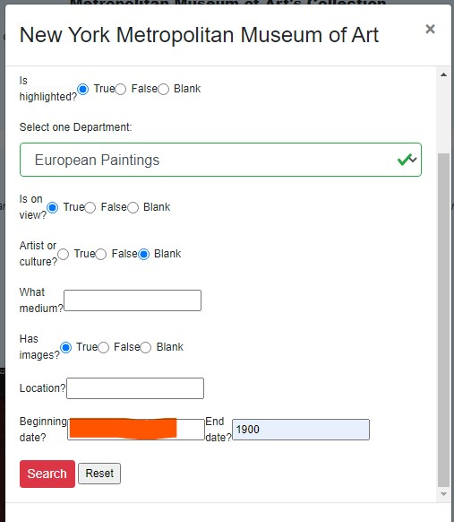
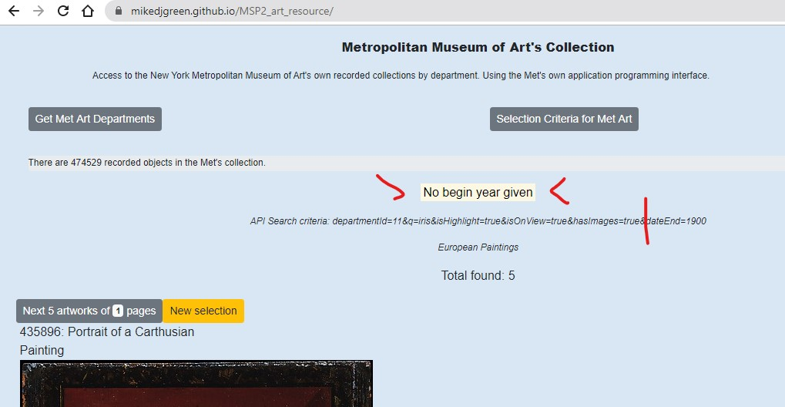
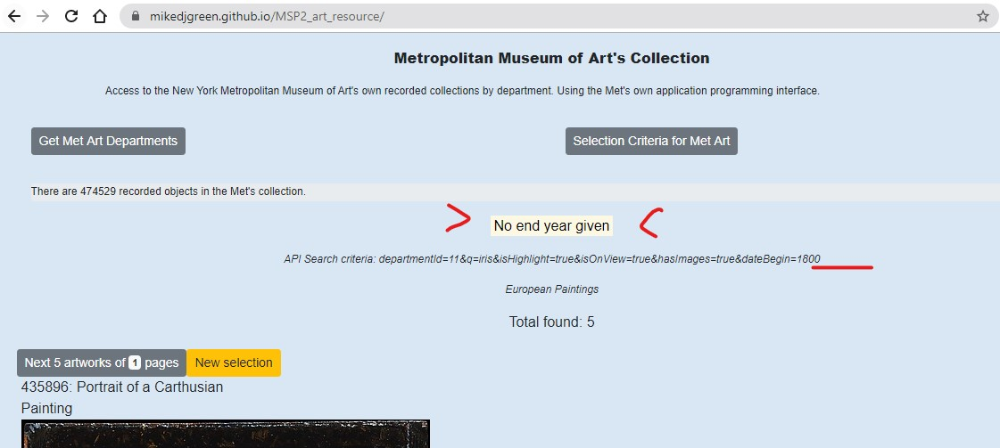
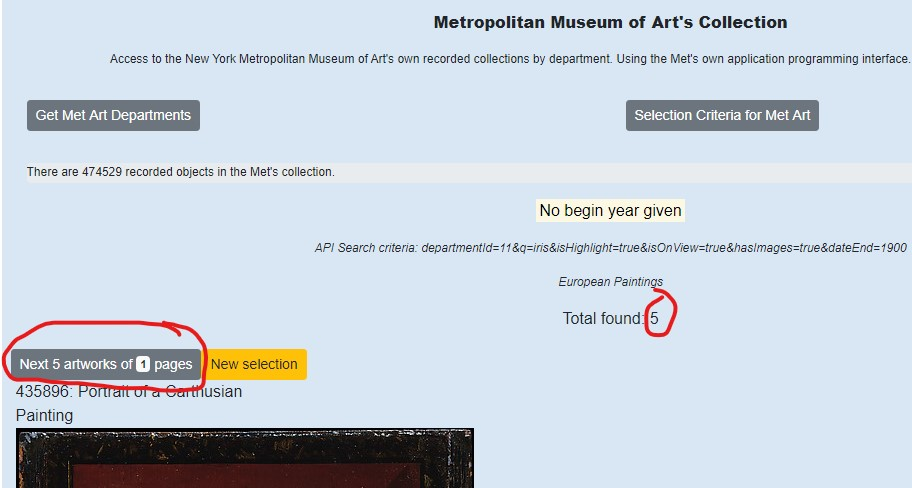
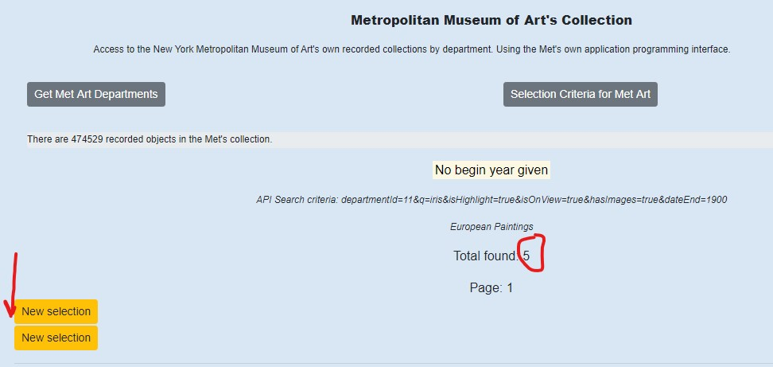
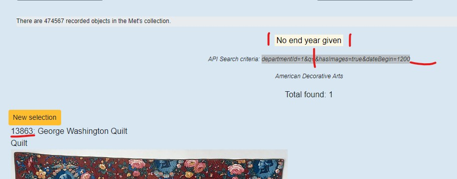
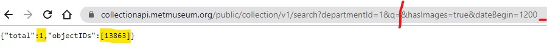

## Testing

**1. Open the resource page and read introduction informing viewer of its purpose.**


**2. Check that the Metropolitan Museum of Art's API search request produces the same number of objects as the search criteria given by the form.**

### Museums search API invoked


### Form's criteria search invoked


For the given criteria both give a total of 13 objects found in the Metropolitan Museum of Art's collection.

### **Anomaly found in API's search function.**
Unfortunately found that when reversing the order of the criteria in the API call, I received only one object returned.


Added issue #36 on 7th October to API's Github and given email address: openaccess@metmuseum.org, on September 22nd 2020.


**3. Check that a blank search term works.**

### Museums search API invoked with blank 'q'


### Form's criteria search invoked with blank 'q'


### Museums search API invoked with empty quotes 'q'


### Form's search invoked with empty quotes 'q'


_Although both API and Form searches match results, I believe that the returned result for blank search term 'q' to be misleading. 
Proposing to intercept blank search terms on form and replace with empty quotes._

**4. Testing enhancement. Selection on department name rather than department id.**

Incorporated a drop down selection list of department names rather than numeric department identifiers within the selection criteria form.
Testing that the department name selected can be easily converted back to it's identifier for the API search endpoint.


Comparing with API's search using same search parameters


Result totals match.


**5. Try to submit the form with all inputs valid and verify that a success message appears.**

No success message as no valid action on submit. Method will be "POST" as there is personal information.


**6. Check Departments modal form works.**


Please note that the API does not return departments of id 2 nor 20.


**7. Check pagination of found works.**

Search for more than one page (5 works) of art works.


Next page


Previous page


**8. Repeat selection criteria.**

Due to first selection returning 0 results, attempted to call the selection form again and amend selection criteria.

This produced an error in the selection criteria form. 

Repeated department name selection drop-down input fields.


**Fix**

```javascript
document.getElementById("selDept").innerHTML += selHTML;
```

changed to:

```javascript
document.getElementById("selDept").innerHTML = selHTML;
```

**9. Testing enhancement. Criteria warning display**

Introduced a warning division to display search form validation messages.
This is to capture 'dateBegin' and 'dateEnd' errors, as API endpoint discusses 
> You must use both dateBegin and dateEnd 





No end date selected gives a warning too.



**10. Problem when only one page (5 art works) found.**

When only one page worth of art works are found for a selection, then there should not be a 'next page' button displayed.



When this 'next page' button is selected, the works disappear, and there is no button to get them back (without re-entering the selection form).




**Fix**

```javascript
function generatePaginationButton(pageCnt) {
   
    document.getElementById("metPages").innerHTML = `<table><tr><td>`;
    if ( pageCnt > 1) {
        document.getElementById("metPages").innerHTML += `<button id="btnPrev1" onClick="writePreviousPage(${pageCnt})" class="btn btn-secondary btn-sm">Previous 5 artworks of <span class="badge badge-light">${pageCnt}</span> pages</button>`;
    }
    document.getElementById("metPages").innerHTML += `</td></tr>`;

    document.getElementById("metPages").innerHTML += `<tr><td>`;
    if ( pageCnt > 1) {
        document.getElementById("metPages").innerHTML += `<button id="btnNext1" onClick="writeNextPage(${pageCnt})" class="btn btn-secondary btn-sm">Next 5 artworks of <span class="badge badge-light">${pageCnt}</span> pages</button>`;
    }
    document.getElementById("metPages").innerHTML += `</td></tr>`;
 ```
**11. Testing 2 criteria warnings.**

As well as allowing incomplete dates, but warning of the selection, could have a blank search term 'q'.
Currently only the one warning is displayed.



Checked to see if the API search gives the same result. It does.



### Responsiveness on search results

**Using [Am I Responsive](http://ami.responsivedesign.is/)**

At first the search results looked OK, but wider viewports could utilise the right hand side for the artwork's details, whilst the left hand side is left for the image(s).


Testing different screen sizes:
| Chrome's Inspect emulator           | width  | breakpoint |
|-------------------------------------|--------|------------|
| Nokia Lumia                         | 320px  | (default)  |
| Nexus 7                             | 600px  | sm         |
| iPad :                              | 768px  | sm/md      |
| Kindle Fire:                        | 800px  | md         |
| iPad Pro:                           | 1024px | lg         |
| Laptop with MDPI screen             | 1280px | xl         |


Nokia's viewport truncated total line:


Nexus:


iPad:


iPad Pro:


